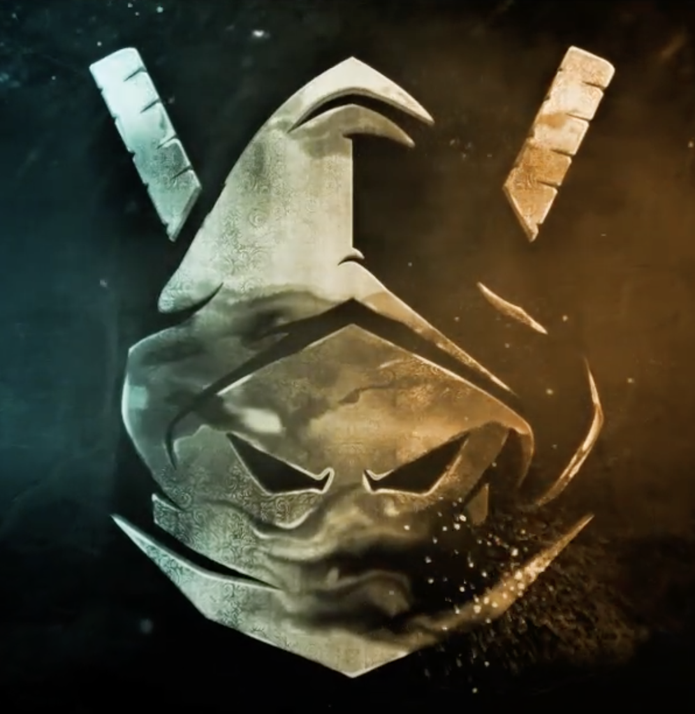
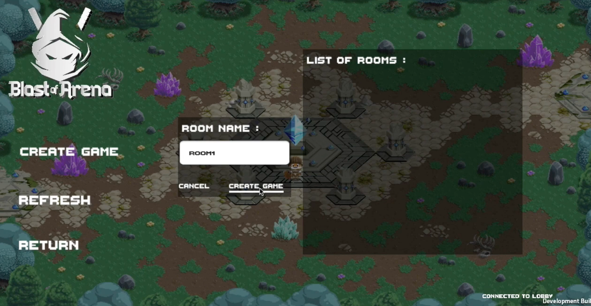

<!-- PROJECT LOGO -->
<br />
<p align="center">
  <a href="https://github.com/nicklamyeeman/Blast-of-Arena">
    
  </a>

  <h3 align="center">BLAST OF ARENA</h3>

  <p align="center">
    A game made for the 1st semester in Korea, in Keimyung University
    <br />
    <a href="https://github.com/nicklamyeeman/Blast-of-Arena"><strong>Explore the docs »</strong></a>
    <br />
    <br />
    <a href="https://github.com/nicklamyeeman/Blast-of-Arena/issues">Report Bug</a>
    ·
    <a href="https://github.com/nicklamyeeman/Blast-of-Arena/issues">Request Feature</a>
  </p>
</p>


<!-- TABLE OF CONTENTS -->
## Table of Contents

* [About the Project](#about-the-project)
  * [Built With](#built-with)
* [Getting Started](#getting-started)
  * [Prerequisites](#prerequisites)
  * [Installation](#installation)
* [Usage](#usage)
* [Roadmap](#roadmap)
* [Contributing](#contributing)
* [Contact](#contact)
* [Acknowledgements](#acknowledgements)


<!-- ABOUT THE PROJECT -->
## About The Project

This game is a rogue like / Moba in multiplayer where the goal is to survive each round. The one who will have survived the most rounds wins the game.
This project was realized in the framework of a school project in South Korea.
A [Game Design Document](https://github.com/nicklamyeeman/Blast-of-Arena/blob/main/10pGDD.pdf) is available for this project.


Check out the trailer made for this game here : 
[](https://www.youtube.com/watch?v=JWyEN3qQDcw "Blast of Arena (2020) - Official Trailer - EN")

If you want the trailer in French you can find it [here](https://www.youtube.com/watch?v=M0kCKw2tsxA)

### Built With

* [Unity](https://unity.com/)


<!-- GETTING STARTED -->
## Getting Started

To get a local copy up and running follow these simple steps.

### Prerequisites

Be sure you have Unity installed on your PC, then open a terminal

### Installation

1. Clone the repo
```sh
git clone https://github.com/nicklamyeeman/Blast-of-Arena.git
```
2. Open Unity & download Unity version 2019.4.12f1

3. Open the game with Unity


<!-- USAGE -->
## Usage

Just launch the game, you will have the option to create and host a game or direcly join a room with its name



<br/>

Navigate throught the menu with your mouse and click on the option you want


Move around using :
             <kbd>Z</kbd>
<kbd>Q</kbd> <kbd>S</kbd> <kbd>D</kbd>

You can attack with mouse clicks


You have special powers with : 
<kbd>A</kbd> : Bomb

<kbd>E</kbd> : Invisibility

<kbd>Space</kbd> : Dash


Discover the different atmospheres of the game


</br>
This game is made to be a multiplayer game and we tried to do it with the less latency possible


### BE CAREFUL

This version is NOT be the last one for copyright reasons.

There is a gameplay video there : 
[](https://www.youtube.com/watch?v=i_qKqUTWsPQ "Blast of Arena")


<!-- ROADMAP -->
## Roadmap

See the [open issues](https://github.com/nicklamyeeman/Blast-of-Arena/issues) for a list of proposed features (and known issues).


<!-- CONTRIBUTING -->
## Contributing

Contributions are what make the open source community such an amazing place to be learn, inspire, and create. Any contributions you make are **greatly appreciated**.

1. Fork the Project
2. Create your Feature Branch (`git checkout -b feature/AmazingFeature`)
3. Commit your Changes (`git commit -m 'Add some AmazingFeature'`)
4. Push to the Branch (`git push origin feature/AmazingFeature`)
5. Open a Pull Request

We were 4 originally on this project : 
 - [LAM YEE MAN Nick](https://github.com/nicklamyeeman)
 - [DEMEESTER Alexandre](https://github.com/rokuo)
 - [MALARDE Arthur](https://github.com/arthurqqq)
 - [DESPAGNE Eddy](https://github.com/Minijinski)


<!-- CONTACT -->
## Contact

Nick LAM YEE MAN - [@nickauteen](https://twitter.com/nickauteen) - nick.lam-yee-man@epitech.eu

Project Link: [https://github.com/nicklamyeeman/Blast-of-Arena](https://github.com/nicklamyeeman/Blast-of-Arena)


<!-- ACKNOWLEDGEMENTS -->
## Acknowledgements

* [Best-README Template](https://github.com/othneildrew/Best-README-Template)


<!-- MARKDOWN LINKS & IMAGES -->
<!-- https://www.markdownguide.org/basic-syntax/#reference-style-links -->
[contributors-shield]: https://img.shields.io/github/contributors/nicklamyeeman/repo.svg?style=flat-square
[contributors-url]: https://github.com/nicklamyeeman/repo/graphs/contributors
[forks-shield]: https://img.shields.io/github/forks/nicklamyeeman/repo.svg?style=flat-square
[forks-url]: https://github.com/nicklamyeeman/repo/network/members
[stars-shield]: https://img.shields.io/github/stars/nicklamyeeman/repo.svg?style=flat-square
[stars-url]: https://github.com/nicklamyeeman/repo/stargazers
[issues-shield]: https://img.shields.io/github/issues/nicklamyeeman/repo.svg?style=flat-square
[issues-url]: https://github.com/nicklamyeeman/repo/issues
[license-shield]: https://img.shields.io/github/license/nicklamyeeman/repo.svg?style=flat-square
[license-url]: https://github.com/nicklamyeeman/repo/blob/master/LICENSE.txt
[linkedin-shield]: https://img.shields.io/badge/-LinkedIn-black.svg?style=flat-square&logo=linkedin&colorB=555
[linkedin-url]: https://linkedin.com/in/nicklamyeeman
[product-screenshot]: images/screenshot.png
